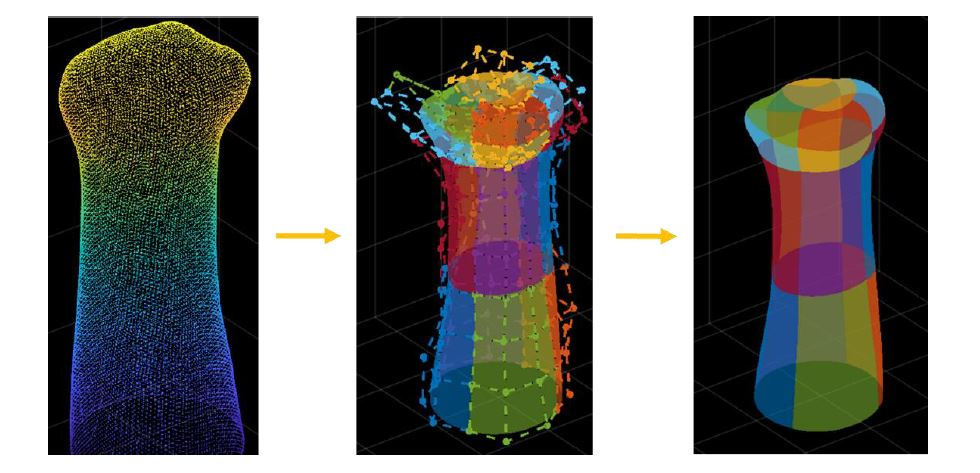
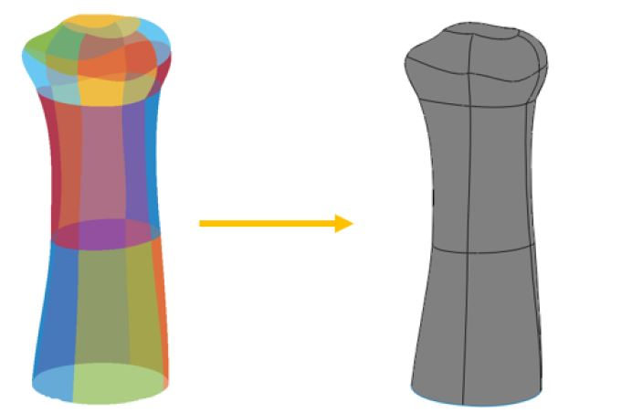
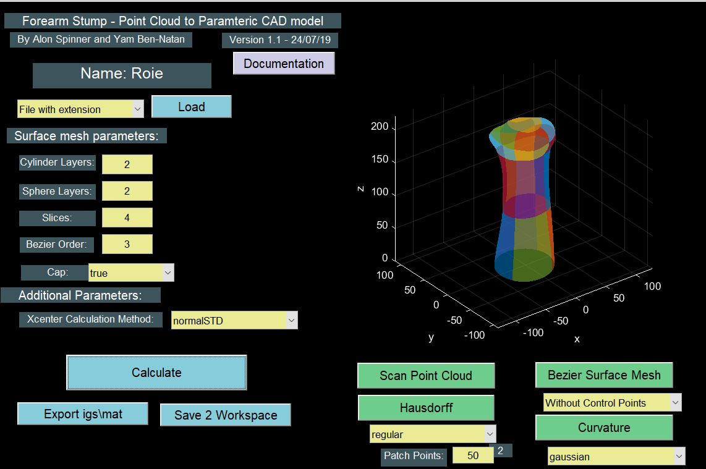

# Bezier surface reconstruction from scanned point cloud of a forearm stump for commercial CAD tool 

1) Surface reconstruction from point cloud. Real data of multiple patients used.
2) The parameteric surface is constructed from bezier patches with G1 continuity (All math included)
3) through class BezCP, other non-stumplike surfaces can be reconstructed
3) through Irit we convert the paramteric surfaces to IGS format that can be read in any CAD program
4) fully documented work

5) Data not provided for patient confidentiatly

